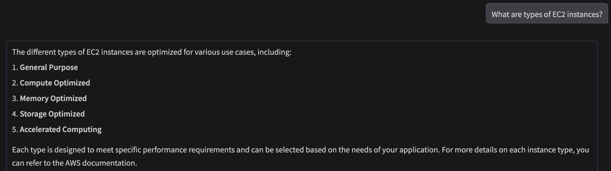
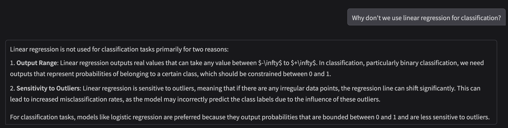
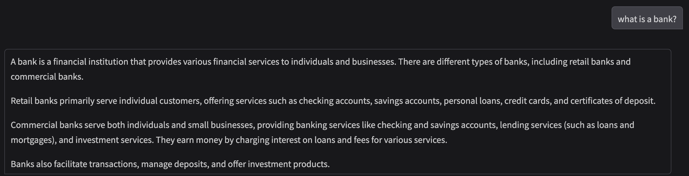

## Table of Contents
1. [Setup](#setup)
2. [Code](#code)
3. [Results](#results)

<a href="https://medium.com/@bajra.pradeep/a-diy-rag-system-using-langchain-16292b6531b8">READ IN MEDIUM</a>

RAG is one of an important concept in Large Language Modeling that prevents LLMs from hallucinating. Having understood what it is and how it works, I wanted to write a RAG code from scratch. To do this, the main thing I needed was an external database that the model can retrieve information from.

As a curious learner, I rely heavily on note-taking to understand and connect ideas, and Obsidian has been my go-to tool. What drew me in was its ability to link concepts seamlessly and store everything in Markdown (.md) format, making my notes easy to organize and even publish. Inspired by this, I thought of building a retriever system that could act as a personal QA assistant — capable of answering questions directly from my own notes.

The entire code and the setup is defined in the <a href="https://github.com/pb8294/DIYLangChainRAG/tree/main">github</a> and the small portion of my notes (used for RAG database) is available for <a href="https://drive.google.com/drive/folders/18T11r8bjewXGnY8_mrI6XWzwsC6yG8e0?usp=sharing">download here</a>.

Before we begin, we need to create an account in OpenAI API portal and setup an API_KEY to run the code.

<i>Note: OpenAI needs a minimum of $5 hold to use the API and setup the API keys</i>

<h2 id="setup">Setup</h2>
Setup the conda environment and install the necessary packages using the requirements.txt
 
<pre>
conda create --name "environment_name" python="python_version"
conda activate "environment_name"
pip install -r requirements.txt
</pre>

<h2 id="code">Code</h2>
First we setup the necessary libraries required for the entire project which includes gradio for chat interface and langchain for RAG and LLM components.

<pre><code>
import os
import glob
import gradio as gr

from langchain.document_loaders import DirectoryLoader, TextLoader
from langchain.text_splitter import CharacterTextSplitter
from langchain.schema import Document
from langchain_chroma import Chroma
from langchain_openai import OpenAIEmbeddings, ChatOpenAI
from langchain.memory import ConversationBufferMemory
from langchain.chains import ConversationalRetrievalChain
</code></pre>
Define variables which include the name of the model you want to interface with in OpenAI, the name of the vector store and the API key for OpenAI.

<pre><code>
# Setup the GPT model you want to use (GPT-4o-mini is a cheap option)
model = 'gpt-4o-mini'

# Name of the database where the chunks of external documents are vectorized
db_name = 'knowledge_database'

# Enter your OPENAI_API_KEY as environment variable
os.environ['OPENAI_API_KEY'] = "YOUR_OPENAI_API_KEY"
</code></pre>
Read the documents using DirectoryLoader and TextLoader from the concepts folder that is downloaded from the google drive.

<pre><code>
# Point to the `concepts` folder downloaded from the Google Drive
folders = glob.glob("concepts/*")
documents = []

# Goes through each folder and reads all the md files in it
for folder in folders:
    doc_type = os.path.basename(folder)
    loader = DirectoryLoader(folder, glob="**/*.md", loader_cls=TextLoader, loader_kwargs={"encoding": 'utf-8'})
    folder_docs = loader.load()
    for doc in folder_docs:
        doc.metadata['doc_type'] = doc_type
        documents.append(doc)
</code></pre>
Divide the data read from the concepts folder into chunks of size 2000 with an overlap of 400 characters.
<pre><code>
# Split the documents into chunks
text_splitter = CharacterTextSplitter(chunk_size=2000, chunk_overlap=400)
chunks = text_splitter.split_documents(documents)
Create a vector store for the chunks

# Create a vector storage
embeddings = OpenAIEmbeddings()
if os.path.exists(db_name):
    Chroma(persist_directory=db_name, embedding_function=embeddings).delete_collection()
vectorstore = Chroma.from_documents(documents=chunks, embedding=embeddings, persist_directory=db_name)
</code></pre>
Setup the LLM, memory and retriever for RAG system and launch the UI.
<pre><code>
# Create LLM, memory and retriever and start a conversation chain
llm = ChatOpenAI(temperature=0.8, model_name="gpt-4o-mini")
memory = ConversationBufferMemory(memory_key="chat_history", return_messages=True)
retriever = vectorstore.as_retriever()
conversation_chain = ConversationalRetrievalChain.from_llm(llm=llm, retriever=retriever, memory=memory)
# Define a chat function which Gradio will use to communicate with LLM
def chat(message, history):
    result = conversation_chain.invoke({"question": message})
    return result["answer"]

# Start the chat interface
view = gr.ChatInterface(chat, type="messages").launch()
</code></pre>

<h2 id="results">Results</h2>
<figure>
  <picture>
    
  </picture>
  <figcaption>Accessing information in the `aws` folder in `concepts` database</figcaption>
</figure>

<figure>
  <picture>
    
  </picture>
  <figcaption>Accessing information in the `machinelearning` folder in `concepts` database</figcaption>
</figure>

<figure>
  <picture>
    
  </picture>
  <figcaption>Accessing information in the `finance` folder in `concepts` database</figcaption>
</figure>

<h2 id="reference">REFERENCE</h2>
<a href="https://www.udemy.com/share/10bOXH/">Linked is a good course</a> in Udemy that is a good place to understand LLMS, and Agentic AI with hands-on experience.